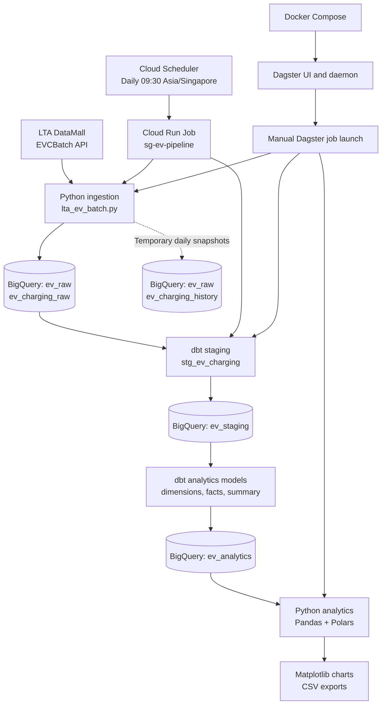

# SG EV Charging Analytics — Architecture

## 1. Overview

This project ingests Singapore EV charging-point data from the Land
Transport Authority (LTA) DataMall EV Charging Points Batch API, stores
the data in Google BigQuery, transforms it with dbt, and generates
analytical outputs using Pandas, Polars, and Matplotlib.

Two execution paths are supported:

- **Production:** Cloud Scheduler triggers a Cloud Run Job daily at
  09:30 Singapore time. The production job performs ingestion and dbt.
- **Development and manual execution:** Docker Compose runs Dagster.
  A manually launched Dagster job performs ingestion, dbt build and
  tests, followed by Python analytics.

Dagster scheduling should remain disabled while Cloud Scheduler owns
the production schedule.

## 2. Architecture diagram

## 3. Components and responsibilities

| Component | Responsibility |
|---|---|
| LTA DataMall EVCBatch | Supplies the latest batch download link and EV charging data |
| Python ingestion | Downloads the batch, flattens charging-point records, and loads BigQuery |
| BigQuery `ev_raw` | Stores the current raw snapshot and temporary history snapshots |
| dbt staging | Exposes a staging view and renames `current` to `current_type` |
| dbt analytics/star models | Produces charger dimensions, charging-point facts, and regional summaries |
| BigQuery `ev_analytics` | Serves analytics-ready tables |
| Pandas | Computes KPI and summary outputs |
| Polars | Independently validates regional connector counts |
| Matplotlib | Creates charts for reporting and presentations |
| Cloud Run | Executes the production ingestion and dbt pipeline |
| Cloud Scheduler | Triggers Cloud Run every day at 09:30 Singapore time |
| Docker Compose and Dagster | Support manual end-to-end execution and development |

## 4. BigQuery data layers

GCP project: `sg-ev-510713`

### Raw layer: `ev_raw`

- `ev_charging_raw`: latest ingested snapshot.
- `ev_charging_history`: temporary daily history collection.

### Staging layer: `ev_staging`

- `stg_ev_charging`: staging view over the raw source.
- The source column `current` is renamed to `current_type`.

### Analytics layer: `ev_analytics`

- `dim_ev_charger`: descriptive charger and location attributes.
- `fct_ev_charging_points`: connector-level facts, status, price, power, region, and timestamps.
- `ev_charging_summary`: aggregated connector and station metrics by region.

The current region categories are Central, East, North, North-East, and West.
Review unmapped postal sectors before using regional figures in formal reporting.

## 5. Scheduling and execution

### Production

- Cloud Scheduler job: `sg-ev-daily-schedule`
- Cloud Run Job: `sg-ev-pipeline`
- Region: `asia-southeast1`
- Schedule: `30 9 * * *`
- Time zone: `Asia/Singapore`

Cloud Scheduler is the only production scheduler. The production Cloud Run
job currently performs ingestion and dbt; it does not run the analytics
script.

### Manual Dagster execution

Launch `ev_charging_pipeline` from the local Dagster UI at
`http://localhost:3000`.

The job executes:

1. `ingest_lta_batch`
2. `run_dbt_build`
3. `run_ev_analytics`

The downstream steps run only after the preceding step succeeds.

Do not enable the Dagster schedule while Cloud Scheduler is managing
production runs.

## 6. Temporary history plan

The project plan is to retain one daily history snapshot per Singapore
calendar day. History appending should execute, while refreshing the current snapshot
and running the production pipeline should continue.

The ingestion guard prevents another snapshot from being appended when
a snapshot for that Singapore calendar day already exists. It does not
automatically remove duplicate history records created by earlier runs.

## 7. Security

- Store the local LTA API key in `.env`.
- Never commit `.env` or credentials to source control.
- Production uses Google Secret Manager secret `lta-api-key`, exposed to
  the Cloud Run container as `LTA_API_KEY`.
- Use the configured Cloud Run service account for Google Cloud access.
